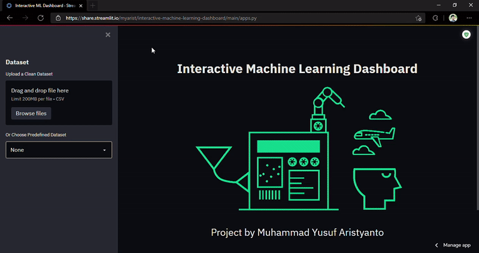

<h1 align="center">✨ Interactive ⚙️ Machine Learning 📚 Dashboard 🖥️</h1>

<p align="center">
    
</p>

<p align="center">
    This project was created to make it easier for us to perform simulations on Machine Learning. <br> This project also aims to make the data exploration experience more interactive and fun. Without needing a lot of code, we can do it right away with a click and select.
</p>


## File Structure

```
.
├── images
├── functions
│   ├── custom_dataset.py
│   ├── get_best.py
│   ├── get_classifier.py
│   ├── get_data.py
│   ├── get_pca.py
│   ├── get_plot.py
│   ├── get_result.py
│   └── get_sidebar.csv
├── sample
│   ├── 2D.csv
│   └── 3D.csv
├── apps.py
├── Procfile
├── requirements.txt
├── setup.sh
.
```


## File Description

There are some important files in this repository, such as:
- `functions` folder contains various functions and procedures to maximize the performance and features of the dashboard. 
- `sample` folder contains some sample data that can be used to test the file upload feature.
- `apps.py` is the python file to deploy our web app in Streamlit.


## How to Use

To run the project locally, you can download this repo and type 

```
streamlit run apps.py
```

To view the project as a deployed online web app, you can check out with [Heroku](https://interactive-ml-dashboard.herokuapp.com/)




## References

This project was inspired by:
- [Streamlit cheat sheet](https://streamlit-cheat-sheet.herokuapp.com/)
